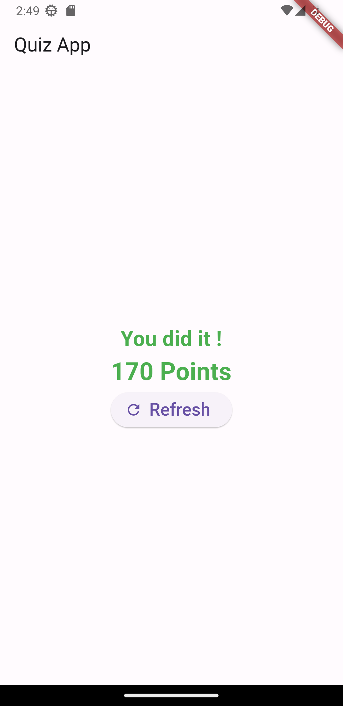

# Simple Quiz Mobile App

The Simple Quiz Mobile App is a mobile application that allows users to participate in a quiz and test their knowledge on various topics. It provides an interactive and engaging way to learn and have fun.

## Features

- Scoring system: Each question has a predefined score, and the app calculates the total score based on the correct answers.
- Result summary: Once the quiz is completed, the app displays a summary of the user's score and performance.

## Screenshots

## Getting Started

To use the Simple Quiz Mobile App, follow these steps:

1. Clone the repository: `git clone https://github.com/your-username/simple-quiz-app.git`
2. Install the necessary dependencies: `npm install` or `yarn install`
3. Build and run the app on your mobile device or simulator: `npm run start` or `yarn start`
4. Enjoy the quiz and test your knowledge!

## Contributing

Contributions are welcome! If you find any bugs or have suggestions for new features, please open an issue or submit a pull request.

## License

This project is licensed under the MIT License.

## Acknowledgments

- The Simple Quiz Mobile App was inspired by the love for quizzes and learning.
- Special thanks to the contributors and the open-source community for their valuable contributions and resources.
